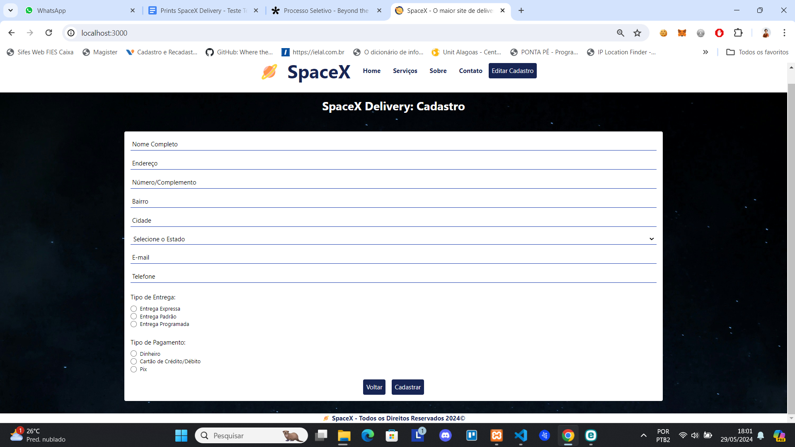
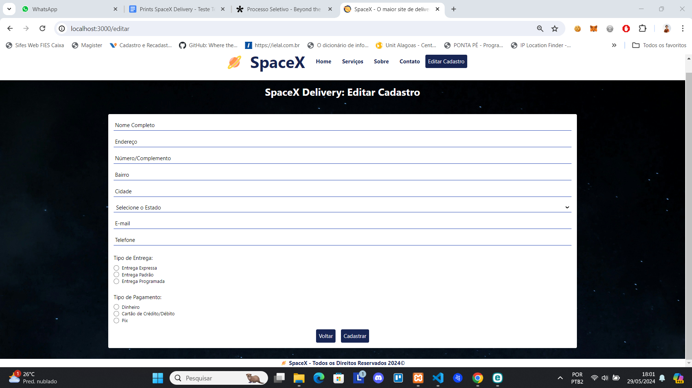

# SpaceX Delivery

## Descrição do Projeto

Bem-vindo(a) ao SpaceX Delivery, uma aplicação web inovadora desenvolvida para facilitar entregas interplanetárias! Esta aplicação foi criada como parte de um teste técnico para a posição de Desenvolvedor Full-Stack React na Beyond The Bytes. Utilizando React para a construção da interface e Tailwind CSS para a estilização, a SpaceX Delivery proporciona uma experiência de usuário moderna e intuitiva. Atualmente, a aplicação inclui funcionalidades de cadastro e edição de cadastro de usuários, permitindo uma gestão eficiente das informações de clientes que utilizam nossos serviços interplanetários.

## Funcionalidades

- **Cadastro de Usuário**: Permite que novos usuários criem uma conta fornecendo informações essenciais como nome, e-mail, endereço e planeta de origem.
- **Edição de Cadastro**: Usuários existentes podem atualizar suas informações de cadastro conforme necessário.

## Tecnologias Utilizadas

- **React**: Biblioteca JavaScript para construção de interfaces de usuário.
- **Tailwind CSS**: Framework CSS utilitário para estilização rápida e customizável.
- **React Router**: Biblioteca para navegação e roteamento de páginas em React.

## Estilização

A estilização da aplicação é feita utilizando Tailwind CSS, que permite uma customização rápida e eficiente através de classes utilitárias. A configuração do Tailwind pode ser encontrada no arquivo `tailwind.config.js`.

## Tela de Cadastro de Usuários 

## Tela para Editar Cadastro de Usuários

2024 - Maria de Fátima Nunes Alves
